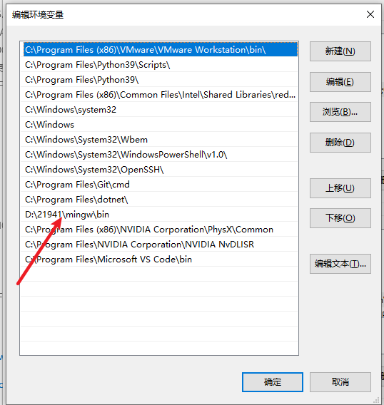
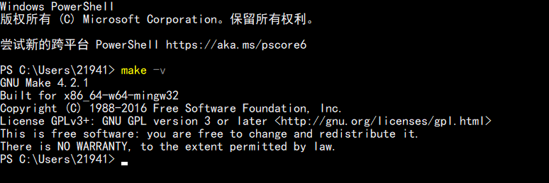
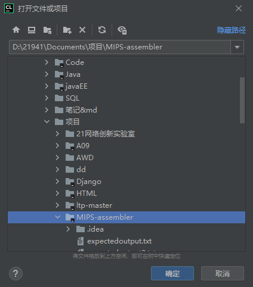
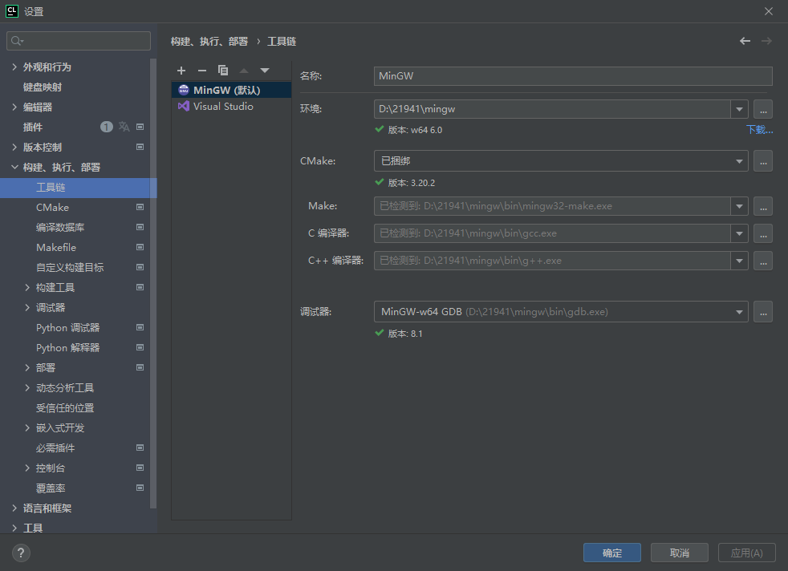
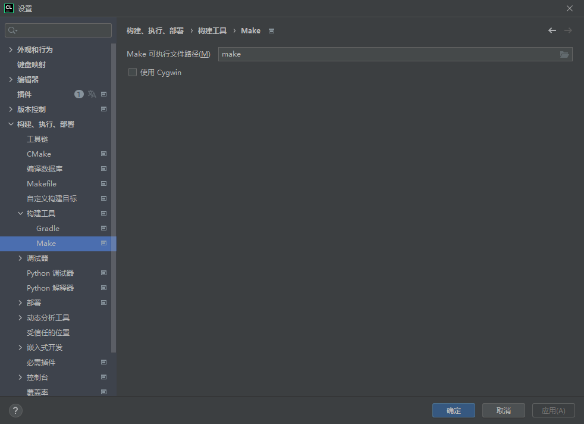
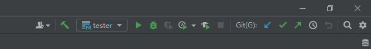
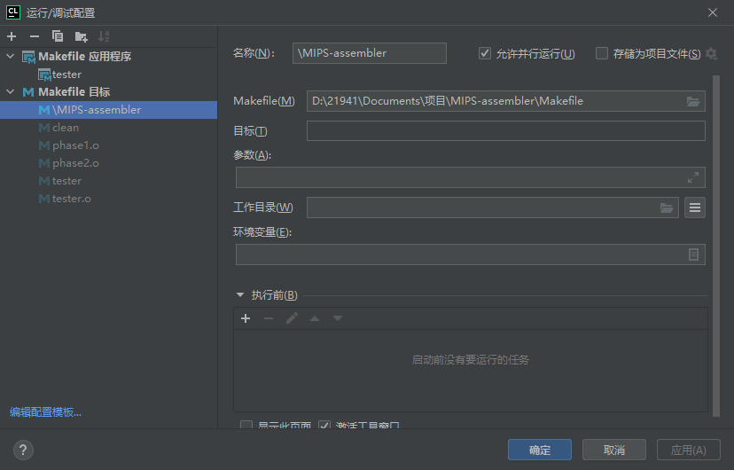
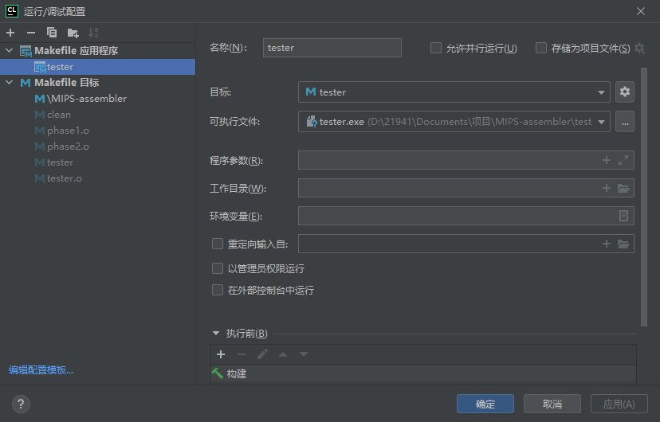
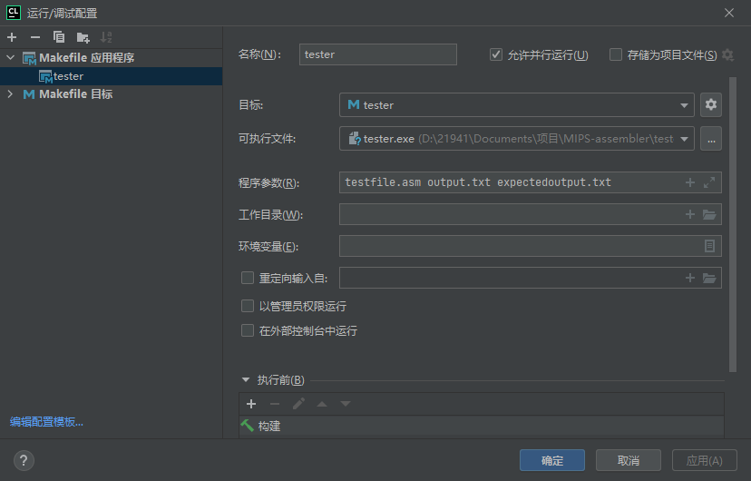

# Clion 配置 Makefile

## 0. 准备工作

### 下载：

安装 `MinGW` (下载：[Download MinGW-w64 - for 32 and 64 bit Windows from SourceForge.net](https://sourceforge.net/projects/mingw-w64/files/Toolchains targetting Win32/Personal Builds/mingw-builds/installer/mingw-w64-install.exe/download))

配置环境变量：




**注：**

`MinGw64\bin` 文件夹里面，将 `mingw32-make.exe` **原地**复制一份，并重命名为 `make.exe`，这样做的目的是为了以后输入命令可以直接使用 `make` 作为命令，可以认为起了个别名，也可以认为是和Linux保持风格一致。


### 安装：

`Clion` 安装插件：`Makefile Language` (别人的版本叫 `Makefile Support`)


### 测试：

`powershell`

```sh
make -v
```




## 1. 导入项目

### 导入：

`Clion 2020.1` 版本以上将自动识别 `Makefile` 项目，直接导入，稍加配置即可 




## 2. 配置环境

### MinGW：

默认 `MinGW` （因为 `clang` 缺少头文件）

环境部分：下拉选择好 `MinGW` 后会自动识别下面的参数




### Makefile：

只需要修改倒数第二个参数——构建目标（默认为 `all`) 改为：tester


### 构建工具/Make：

Make 可执行文件路径(M)：make（和前面对应起来了）




## 3. 运行/调试配置

下拉选择框，编辑配置：




### 添加 Makefile 目标：

参数：Makefile（M) : 项目目录/Makefile




### 添加 Makefile 应用程序：

选择可执行文件 `tester.exe` (Linux: `tester`) ，目标参数会自动补全




程序参数为：（README:How to Compile and Test this Project）

