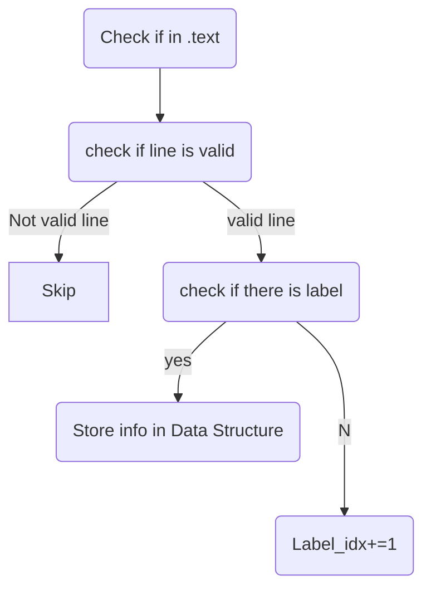
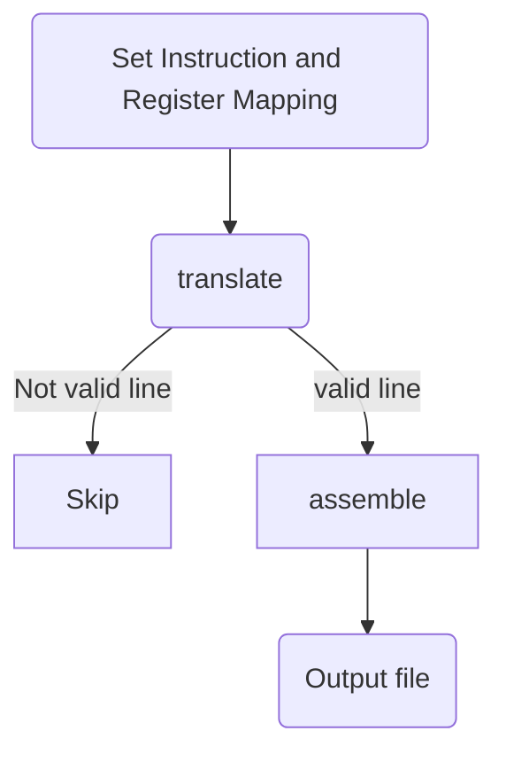

# **Ass1_Report_120040077_Zhouliang_Yu**

## A Big Picture and Work Flow

This project implements a MIPS assembler. In Phase1 we scan the test case once and store the labels and their corresponding addresses in a LabelTable. In the phase2 we first put the binary representation form of each RIJ instructions and registers into maps. Utimately we can assemble the instructions inside the test case file with the help of assembler and translater.

## **How to Compile and Test this Project**

```shell
make 
./tester testfile.asm output.txt expectedoutput.txt
make clean 
```

## **Phase1 Pipline**

we use instringstream to access the commponents in the line. If line is blank or comment, we ignore this line and move to the next line. Otherwise we check if the is a ':' among the line, if yes we the label before ':' symbol and its corresponding address.

#### **How Do We Skip .data Part**

we set up a bool indicater "is_text" to indicate if we are in the region of .text.

#### **How Do we discard blank and comments**

we use isstringstream to sparse the line components. If we find the line is a blank line or a totally comment, we simply skip the line.

#### **How Do we Detect and store the Label**

we define a new type "LabelTable" to be a map that takes string type as key and int type as value. So once we detect ':' within the line we can store the content before ':' as label, and its corresponding address as its value to the LabelTable.
#### **Implementation Details of Label Address**
initially we set the variable "Label_idx" 0, every time we pass a valid line we add Label_idx with 1. So for each label there address is the Label_idx when visiting the its first follow up valid line.

#### **Core Code of Phase1**
```C++
if (!Comment_blank_detector(line) && is_text && line != ".text")
        {
            //find the ":"
            if (p1.find(':') != string::npos) {
                //store the label in the LabelTable
                int pos = p1.find(':');
                string Lable = p1.substr(0, pos);
                LableMap[Lable] = Label_idx;
                continue;
            }

            if (p2.empty())
            {
                continue; 
            } 
            
            p2= "";
            Label_idx += 1;
```

#### **Work Flow of Phase1**




## **Phase2 Pipline**
In Phase2, we use "Instruction_map" to store each instruction and their corresponding binary form string. Then we use "Inst_type_map" to store the instructions' type and "Reg_map" to store each registers with corresponding binary numbers. To make it easy when translating the instruction we also map instructions parse sequence in the "extraction_order" map. Then we will be able to starting assemble translating the instructions.

#### **How to Design the Instruction_map**
In our instruction map, we store the binary segments we already know and we use variable to temporarily represent the binary segments not known yet. For example for "add" instruction we store it to the Instruction_map like this:
```C++
Instruction_map["add"] = "000000ssssstttttddddd00000100000";
```
Which means that its opcode is "000000", sa = "00000", function = "100000". Same Logic for other instructions. 

Selected sample instruction map storage:
```C++
Instruction_map["sra"] ="00000000000tttttdddddvvvvv000011";
Instruction_map["srav"] ="000000ssssstttttddddd00000000111";
Instruction_map["srlv"] ="000000ssssstttttddddd00000000110";
Instruction_map["bltz"] ="000001sssss00000llllllllllllllll";
Instruction_map["lw"] ="100011ssssstttttoooooooooooooooo";
Instruction_map["sw"] ="101011ssssstttttoooooooooooooooo";
Instruction_map["j"] = "000010jjjjjjjjjjjjjjjjjjjjjjjjjj";
Instruction_map["jal"] ="000011jjjjjjjjjjjjjjjjjjjjjjjjjj";
```

#### **How to Design the Inst_type_map and Reg_map**
The logic of classifying each instruction as RIJ type is like this:
we check the instructions op code if it is "000000" then it is a R-type instruction, if op code is "000011" or "000010" then it is a J-type instruction, otherwise it would be a I-type instruction

We store the Reg_map with each register's name as key and its corresponding binary form as value

#### **Order of Sparsing Line**
Say if we have a line 
```
addi $sp, $sp, -12
```
how to decide the order of sparsing?
the Inst_map indates its module form as:
```C++
Instruction_map["addi"] = "001000ssssstttttiiiiiiiiiiiiiiii";
```
so we know the contents we need to replace is rs, rt and immediate, but we do not know which segment with the line is rs, rt and immediate.
we use the extraction_order map to show the sequence
```c++
extraction_order["addi"] = "tsi";
```
so the first component after "addi" should be "rt", the second should be "rs", and the last is the immediate number.

## Translate
then we can start to translate. So the first job we are going to do is to filt out the irrelevant symbel like ":\t\n#,()" and split out each valid segement within a given line.

#### **Filter**
we use strtok to split the line according to the item that should be discard ":\t\n#,()" then the Filter will return a vector loading each valid segment of the line.

Core Code:
```c++
vector<string> result;
char *discard_item = " :\t\n#,()";
char c_line[100];
char *result_str = strtok(strcpy(c_line,real_line.c_str()), discard_item);
result.push_back(result_str);
while (result_str != NULL)
{
    result_str = strtok(NULL, discard_item);
    if (result_str != NULL)
    {
        result.push_back(result_str);
    }
}

if (result.size() < 5)
{
    while (result.size() != 5) {
        result.push_back("nan");
    }
}
return result;
```


## How to Assemble 
Now that we can access the valid line segments and the instructions' type, sparsing order, and register binary number how can we assemble a line exactly? Instruction without address processing is relative easy, which we only need to replace the unknown parameter with the parsed binary numbers at the corresponding locations. But once we need to deal with address things is going to be difficult.
 
#### J-instruction
When we need to jump in J instruction, the target address would be the base address plus its Label_idx stored in the table, then we translate the address which is initially represented as a decimal number to a 26-bit binary number

Core code for J-type assembling:

```c++
string lable = p1;

int j_pos = result.find('jjj');
result.replace(j_pos, 26, dec2(std::to_string(1048576 + table[labl, 26));
return result;
```

#### I-instruction
When we need to deal with branch instruction we need to determine the address of a branch target. Which is the sum of the offsets in PC+4 and the instruction.
So there are two cases, i. when the label is at the former of the instruction and ii. when the label is first defined at somewhere after the instruction
For the first case we define the offset, which we use gap to represent in the project as:
```c++
int gap = - (Label_idx - table[lable]) - 1;
```
For the second case:
```c++
int gap = table[lable] - Label_idx - 1;
```
when we get the gap we can replace the immediate with the translated form of the gap by a 16-bits binary number.
```c++
result.replace(label_pos, 16, dec2bin(std::to_string(gap), 16));
```

#### How to transform the decimal to binary 
Then the next task we need to be clear with is how do we exactly transform a decimal number to a binary number. 
The input decimal number can be devide into two different cases: 1. greater or equal to 0 2. negtive.
For positive number:
given a bits number "bits" we want to transform to, ie. 16, 26
we generate a "bits" long integer array
then for the given decimal we perform an algorithm to transform it to binary, each bit will be stored at the integer array, then we transform array to a required long binary number.

For a negative number: we generate a "bits" long integer array, then we perform algorithm to transform it to the 2's complement form each bit will be stored at the integer array, then we transform array to a required long binary number.

The Core Code for negative decimal transform to 2's complement:
```c++
for (int c = bits - 1; c >= 1; c--)
    {
        if (binaryNumber[c] == 1)
        {
            if (add1 == 1)
            {
                binaryNumber[c] = 0;
                add1 = 1;
            }
            else
            {
                binaryNumber[c] = 1;
                add1 = 0;
            }
        }
        else
        {
            if (add1 == 1)
            {
                binaryNumber[c] = 1;
                add1 = 0;
            }
            else
            {
                binaryNumber[c] = 0;
                add1 = 0;
            }
        }
    }
    for (int j = 0; j <= bits - 1; j++)
    {
        bin_result += std::to_strin(binaryNumber[j]);
    }
    return bin_result;
```
 
#### **Work Flow of Phase2**

## Sample Output
```shell
__builtin_memcpy 16
__builtin_memcpy_aligned_large 0
__builtin_memcpy_bytes 8
__builtin_memcpy_check 30
__builtin_memcpy_prepare 22
__builtin_memcpy_return 15
__builtin_memcpy_unaligned_large 31
ALL PASSED! CONGRATS :)
```